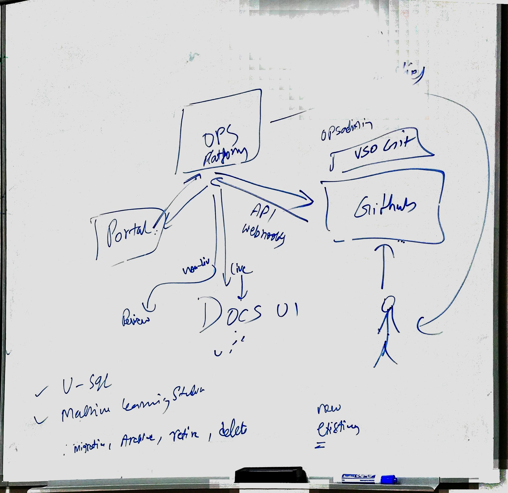

# Onboarding PM for Azure and Windows

## Summary

This document captures my learning and questions as I onboard to the new process. I will flush out the job and identify questions that need answering in this document.

### High Level Job Description

- Maintain relationship with Azure team (Carol Zumault and Tyson and Kris Crider)
    - They own the documentation experience for Azure, which is super duper important to the company.  People need to know how to use Azure and that is their job.
    - They faciliate releases across Carol's larger team and coordinate releases for larger events.  Kris needs to know that Duncan isn't going to mess everything up with Docs leading up to a big release.
    - Tyson needs to know _how_ to incorporate new features across his team.  Example:  The breadcrumbs automation feature was released, but there wasn't any onboarding guidance developed.  Tyson doesn't know how to roll it out across the team. 
    - Coordinate Ship Room meetings?    
        - Next event: Connect on November 15th.
    - Kris Crider is the Project Manager of sorts for the organization, and is leading the weekly shiproom release coordination meeting across the authors and documentation teams under Carol.

- Help Azure Documentation team's needs get prioritized in Dan's backlog.
        - 200 internal contributors, thousands of pull requests.  Azure has a small team to manage lots of contributions and so they want particular functionality that helps them manage that workload, parsing out various specific authoring capabilites to their contributors along with some automation.
    
- Help keep Windows documentation publishing going fowrard through vendor management.  Weekly reporting and meetings with vendor to check in and review status, see where help is needed, etc.

- Become ingrained with documentation migration processes via OPS onboarding guide and other documentation

- Maintain releases assigned to me in the Onboarding area path.  This includes updating the release date information and assigned iterations.

#### In Scope

*What items are in scope for this role?*
- Maintaining status of docsets in the onboarding Area Path in mseng.visualstudio.com/CSI that are in Windows and Azure (https://mseng.visualstudio.com/CSI/_queries/query/3c45d380-9fe3-4fd3-90e9-6a994e1b703a/) and others as they are assigned.

- Helping reference documentation publishing automation, debugging problems with the automation.
- Working with authors to assist their publishing of updated docsets for Conceptual documentation
- Working with Tyson to flesh out and understand features for Azure documentation contributors and reviewers
- Making sure new documentation releases stay on the radar and are logged in CSI/Onboarding
- Making sure redirection is implemented appropriately for items migrated from older publishing systems to docs.microsoft.com
- How can we automate this process further?

#### Basic pipeline

1. caps
2. export to markdown using the exporter tool
3. dumped to a destinatio (repo)

    If Existing
    4. Clean up the dump, test it, verify it, etc.
    5. Push to master, then make live

    if New
    4. Follow the onboarding guide for all the stuff needed done
    5. end up with a master branch with the good stuff in it
    6. push it to the live branch
    7. take the highway to the danger zone and make it live

    8. redirections

#### Redirections

What I know so far about redirections is that you can use the CAPS exporter tool to publish redirections through MTPS.  There is a guy we give the redirections file to and he can update the MTPS database to publish the redirections into MTPS/the old MSDN library.  This is for reference content. 

### Customers and Stakeholders

- Tyson and Carol Zumalt and Kris Crider
    - Azure Documentation Folks.  Largest Customer for Jennifer

- Tara
    - Vendor who will be assigned to WDG documentation.  WDG means Windows. 

- PubDesk
    - Vendor that Sanketh says we can use for large batch processing and ad hoc requests.  
    - Question: How do I log something to PubDesk?

- Beyondsoft
    - Development vendor, mostly for devs

- Aquaint
    - Tara works for them.
        - Run PubDesk & PRReview

*Identify the customers and stakeholders who will be impacted by this change.*

- China Team
    - They do the automation to support generating reference documentation from the languages.  Current languages are here: https://opsdocs.azurewebsites.net/en-us/opsdocs/reference/?branch=master
        - 

### Dependencies, Terms and Definitions

**Reference vs. Conceptual** 
- **Reference** is automatically generated using scripts and automation that has been created by the engineering team.  There is a different process for each language, and our ability to support documentation in this language is dependant on a relatively heavy engineering lift to support the documentation.  

Doc with example on how to onboard Reference documentation in a particular language (REST is the example): https://github.com/MicrosoftDocs/openpublishing-docs/blob/master/openpublishing/docs/reference/rest/howto-onboard-rest-project.md 

- **Conceptual** hand created content, and this means samples, how-tos, quick start guides, and other things that authors actually write.  

**Types of pages** 
    - Hub page...?
    - Landing Page...?
    - Question: When is the edit button not visible?

**Automation**
 - DocFX - a docfx.json file lets us set metadata about a docset and specify which files in a repro are to be included or excluded from the build.  This is part of the automation that creates reference documentation

 - YAML - Yaml is a "data serialization language".... what it is is the output of our automation that builds reference documentation. 

**Tick Tock** 
- Refers to a standardized publishing plan.  THere are 3 different tick tocks depending on the need, 
    one if the docset is new to OPS (because it is new, is on MTPS, is on CAPS or SMS)
    (https://microsoft.sharepoint.com/teams/Visual_Studio_China/_layouts/OneNote.aspx?id=%2Fteams%2FVisual_Studio_China%2FShared%20Documents%2FDOCS.MSFT&wd=target%28Engagement.one%7CA67BF78E-8EB6-4951-98EA-8F854EA3B909%2FTick-Tock%20Checklist%20MTPS%2C%20CAPS%2C%20SMS%20or%20New%20Content%20to%7C377561E4-D94B-468B-8E09-F667BA8B2B2F%2F%29
onenote:https://microsoft.sharepoint.com/teams/Visual_Studio_China/Shared%20Documents/DOCS.MSFT/Engagement.one#Tick-Tock%20Checklist%20MTPS,%20CAPS,%20SMS%20or%20New%20Content%20to%20Docs%20(Template)&section-id={A67BF78E-8EB6-4951-98EA-8F854EA3B909}&page-id={377561E4-D94B-468B-8E09-F667BA8B2B2F}&end),

- one if it is currently on OPS (even if the end point is MSDN or TechNet) (https://microsoft.sharepoint.com/teams/Visual_Studio_China/_layouts/OneNote.aspx?id=%2Fteams%2FVisual_Studio_China%2FShared%20Documents%2FDOCS.MSFT&wd=target%28Engagement.one%7CA67BF78E-8EB6-4951-98EA-8F854EA3B909%2FTick-Tock%20Checklist%20%28Template%5C%29%20-%20From%20OPS%20MSDN%5C%2FTN%7C3A66C739-9897-4A03-A32D-214DA1D04C45%2F%29
onenote:https://microsoft.sharepoint.com/teams/Visual_Studio_China/Shared%20Documents/DOCS.MSFT/Engagement.one#Tick-Tock%20Checklist%20(Template)%20-%20From%20OPS%20MSDN/TN/VS.com%20to%20OPS%20Docs&section-id={A67BF78E-8EB6-4951-98EA-8F854EA3B909}&page-id={3A66C739-9897-4A03-A32D-214DA1D04C45}&end) , and 

- one for reference documentation (https://microsoft.sharepoint.com/teams/Visual_Studio_China/_layouts/OneNote.aspx?id=%2Fteams%2FVisual_Studio_China%2FShared%20Documents%2FDOCS.MSFT&wd=target%28Engagement.one%7CA67BF78E-8EB6-4951-98EA-8F854EA3B909%2FTic%20Tock%20Reference%7CE89164AA-519A-4DBB-B201-8EC968AF731B%2F%29
onenote:https://microsoft.sharepoint.com/teams/Visual_Studio_China/Shared%20Documents/DOCS.MSFT/Engagement.one#Tic%20Tock%20Reference&section-id={A67BF78E-8EB6-4951-98EA-8F854EA3B909}&page-id={E89164AA-519A-4DBB-B201-8EC968AF731B}&end) 

PubDesk
    - Vendor managed.  They merge changes from the master branch to the live branch when it is publishing time.  Azure does this at 10am and 3pm weekdays.

**OPS and its relationship with GitHub**
- OPS is a publishing system that provides several important values.  See https://opsdocs.azurewebsites.net/en-us/opsdocs/whyops?branch=master.  

The basic situation here is that OPS is *ours* and GitHub provides the repos and storage and infrastrucutre on which we build the documentation experience and publishing experience.  OPS says "We show what you see in the live branch", but GitHub provides the live branch and any other branches that we want.

More specifically, you can think of 4 different systems:
- OPS the platform
    - OPS does a lot of the heavy lifting to determine what is ready for publishing.  There are several validating steps that the OPS portal provides to validate links, make sure the TOC appers, and several other things I dont know about yet.
    - OPS stays in sync with GitHub.  If I do something in a tracked repo in github, github will call OPS to do some validation on my push, and then github will tell me how it goes.
- OPS the portal
    - The OPS portal is the tool front end to the OPS system.   You can create new repos in github using OPS.
- GitHub
    - Github provides the repos and branching system and everything all about git.  As stated above, github and OPS communicate with eachother in various scenarios.
- Docs.microsoft.com UI
    - The DOCS UI is the customer facing front end for OPS.  It proviedes the preview expeirence, on review.docs.microsoft.com and the production experience on docs.microsoft.com.  Review.docs.microsoft.com is where changes can be seen for github.

**GitHub**
See above.

**Upstreams**
What is an upstream and how does it work.  An upstream is a reference branch to 

**Private Repos vs. Public Repos**

**Swagger**
This is something for reference documentation.  They generate a swagger file or files and then the swagger provides the instructinos to our automation to generate the appropriate yaml documentation. 

**Monikerize**
Monikerize means add versioning to the reference documentation.  If a thing has a moniker, that moniker denotes the version that it is.   

**CAPS**
CAPS is an old reference documentation system. 

**AppVeyor**

process that generates yaml from Swagger.   h  Swagger is the format or system that our code authors must use so we can generate documenation from their code automatically, particularly the API calls.  AppVeyor only works for certain languages. 

**F1 Metadata**
- Dude when you press F1 in Visual Studio, you can search.  F1 help topics are things that show up in teh help documentation

**

## Business Impact

### Success Criteria

*What metrics identify the success of this change? Provide the baseline value against the identified metrics.*

Carol and Tyson stay Happy
More docs migrate to Docs, and more docs leave MTPS.

### Partners

### Team Members

### Organization and Organization Dynamics

- Jeff Sandquist the GM
    - Carol and Tyson
    - Duncan
    - Dan
        - Jennifer
            - Sanketh/Mike - Azure
            - Sandra - Office
            - Paulina/Tara - Windows
            - James - VS
            - Sudeep - PowerBI and some other shit
            - Khairun Jamal - Dynamics but also does SEO milestone on tick-tocks
        - Mei
            - MVP stuff
        - Rob
            - Rob owns the PM stuff for the docs UI.  
        - Adam 
            - He helped us when my build on OPS died.  Not sure what he owns.
            - Matt Sampson
        - Yun lu - lives in china.  Owns the processes/whatever that generate documeantion from Pyton, CLI and some othe rstuff I can't read.  THere is a list that I saw that one time that describes this. 
        - Den Delimarche - lives in Moldova, which is next to Ukraine.  OWns the processes that generate doucmentation for .net, typescript and nodejs.
        - ke xu
            - Ke does some important stuff but I dont know right now.

    - Arthur Yasinski
        - Jonathan Duncan (JD)  - I forget.  Book a meet/greet.

### Proposal - Docs.microsoft.com 
Why Docs?  https://review.docs.microsoft.com/en-us/help/onboard/docs-overview?branch=master.  COntent matters, and better content -> better adoption.  Docs is for public technical documentation for developers and engineers.  It is not for marketing content, and it is not for partner content.

### Daily responsibilities

What we do each day
- review assigned items in TFS and udpate as necessary

What we do each week
- review status 

### Decision points 

*this section will describe when there are tradeoffs to be made throughout the day or week and why we might break one way or another in the decision*

- How many docsets in a Repo
- 

### Questions?

Who owns features in OPS?
- Rob

- What is the difference between "Provisioning" and "Publishing"?
- "Provisioning" means that we have *not only* created the Repo for the docset, but the repo has been prepared with the right metadata and files that help us with documentation presentation, particularly the open publishing json file and the docfx json file.   Provisioning means connecting OPS and GitHUb and getting that process going.  Publishing means moving content from the master to the live branch and click the "go live" link.

### Feature Design

*System design/backend requirements, interface definition, integration requirements, etc.*

> [!Note]
> This should not include specific implementation details.

### Telemetry & SkyEye

We use  SkyEye for telemetry, and to provide reporting to the docmentation teams for how their docs are being used by the public. find out more at http://skyeye

## Github basics
use git bash, not git for windows.

- `Git Clone < insert url >` - make a local copy of something on github

Fork.  A fork is a personal fork of a repo.   I can work off my personal fork of the repo to make local changes in a series of commits, then push. 

- `git add -A` - Add all my changes.  THis is not just used when adding a file, its also used when changes are made
- `git commit` -m"notes" this commits changes to the local repo
- `git push` - this pushes my changes up to github to the repo I'm working on

After a git push, you can go check the status in github.  

Creating a pull request.  when I want to commit changes to the main repo master branch from my fork I create a pull request.  When I submit the pull request, github kicks off some processing steps taht are specific to Microsoft
- OpenPublishing.build - this makes sure that we pass OPS checks
- CELA check - some nominal legal check.  When these checks are complete I can merge them.

- upstream.  When you fork your repo, you can set an upstream repository so changes to that upstream repository can be synced with your personal fork.
    - `Git fetch upstream` 
    - `Git merge upstream/master`  - merge upstream changes to my master branch
    - then, all changes from upstream are incorporated, and my changes can be made as well.  To incorporate:
    - `Git add -A`
    - `Git commit -m"blah blah"`
    - `Git push` 

### Communication and Training Plan

*Some features require alerting the leadership team and writers. This would prepare parties for upcoming features, announcements about shipped features, information on any breaking changes, deprecated features or features that require an explicit content rebuild step.*

## chicken scratch below

Me:
- Onboarding
- evanegelism of features of OPS for azure
- new features -> Gaps in the plratform

    All OPS features
        0 Rob is the guy for 

        Rob
        Den Delmach
            .net, typescript, node
        Yun - shanghai
            Reference - 
        Jessie - shanhai

        planning in redmond, then in shanghai, switches every quarter

Azure

Azure_Docs_PR          
    private repo
    PRReviewrTeam - Aquent

    Publihsing Team - BeyondSoft - Andy Pasic  4 Dudes

    Andy's team 

    Beyondsoft also has a dev team for jonoathan duncan

Hello All,

Please find some useful links related to onboarding:

One note with Tick tock – please remember we have 3 tick tock templates depending on the scenario:
Tick-Tock Checklist MTPS, CAPS, SMS or New Content to Docs (Template)  (Web view)

Info about reference:
https://msdnstage.redmond.corp.microsoft.com/en-us/ce-csi-docs/azureref/onboarding%20ref%20for%20pms?branch=master 

Ops Partner documentation:
https://opsdocs.azurewebsites.net/en-us/opsdocs/?branch=master 

query:
https://mseng.visualstudio.com/CSI/Onboarding/_queries/query/3c45d380-9fe3-4fd3-90e9-6a994e1b703a/ 

Thank you!
